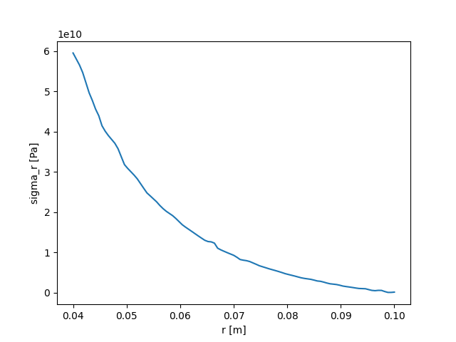
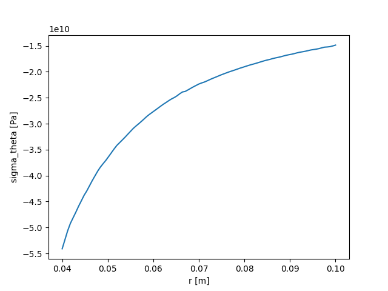
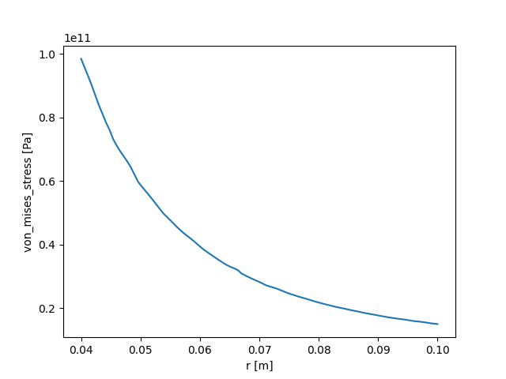

### Introduction
Analytical solutions for computing stress of rotating disk are already exist in literature. However, the solutions are varied according to the authors. Besides, each of them is specified for a kind of thickness profile; and most of them are assumed to be axisymmetric. These limitations make the implementation and development become difficult. The purpose of this project is to use FEM technique to solve this problem in the most general case, make a python package and publish it code freely. <br>
**Contributors**: <br>
Duy Duc NGUYEN, email: duyduc.nguyen@protonmail.com <br>
Nhat Binh Trinh NGUYEN: email: nhatbinhtrinh@gmail.com


### Models
1) axisymmetry + heat <br>
2) full model + heat <br>


### Examples: 
<p align="center">
    
    
    
    <p align="center">Line measurements of stresses of axisymmetry and heat. </p>
</p>


### Import Classes
```
import comp_stress_disk as csd
from comp_stress_disk.Classes.DiskMesh import DiskMesh
from comp_stress_disk.Classes.Material import Material
from comp_stress_disk.Classes.Simulation import Simulation
from comp_stress_disk.Classes.Analysis import Analysis
from comp_stress_disk.Classes.Sigma_r import Sigma_r
from comp_stress_disk.Classes.Sigma_theta import Sigma_theta
from comp_stress_disk.Classes.Sigma_vm import Sigma_vm
import dolfin as df
import matplotlib.pyplot as plt
import math
```


### Install Fenics 
If you are using Linux, you can intall Fenics following this [guidelines](https://fenicsproject.org/download/). <br>
If you are using Window, you can install [Docker Desktop](https://www.docker.com/products/docker-desktop) and download or make your own Fenics image following this [guidelines](https://fenics.readthedocs.io/projects/containers/en/latest/). <br>
If you are using Window 10, you can install Window Linux Subsystem (WLS) and install Fenics to WLS as in Linux. <br>


